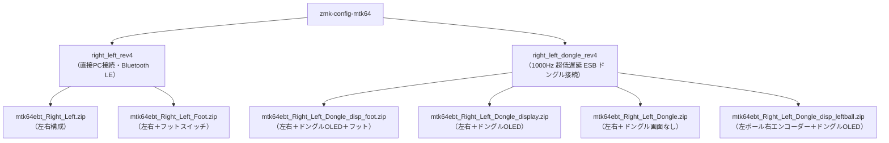

# mtk64ebt Rev4 ファームウェア (zmk-config-mtk64)

mtk64ebt Rev4 用の ZMK ファームウェアリポジトリです。

> [!NOTE]
> mtk64ebt Rev3 用ファームウェアについては、各 `_rev3` ブランチ（例: [right_left_rev3 ブランチ](https://github.com/mentako-ya/zmk-config-mtk64/tree/right_left_rev3#readme)）を参照してください。

---

## 2つの専用ブランチについて

本リポジトリでは、接続方式・用途に応じてファームウェアを **2つの専用ブランチ** に完全分離して管理・ビルドしています。



### 接続方式の比較と選び方

| 比較項目 | ① 直接PC接続【[`right_left_rev4`](https://github.com/mentako-ya/zmk-config-mtk64/tree/right_left_rev4)】 | ② 1000Hz ドングル接続【[`right_left_dongle_rev4`](https://github.com/mentako-ya/zmk-config-mtk64/tree/right_left_dongle_rev4)】 |
| :--- | :--- | :--- |
| **接続形態** | PC ↔ 右手 (Central) ↔ 左手 / フット | PC ↔ ドングル (Central) ↔ 左右手 / フット |
| **通信方式** | Bluetooth Low Energy (BLE Split) | 1000Hz Nordic ESB (超低遅延通信) |
| **ドングル** | **不要**（PCのBluetooth機能で直接接続） | **必要**（専用ドングル親機をPCにUSB接続） |
| **ポーリングレート** | 133Hz（BLE規格の高速パラメータ） | **1000Hz (1ms)**（ゲーミングマウス同等） |
| **バッテリー持ち** | 非常に長持ち（安定・省電力） | 右手側もペリフェラル動作のため省電力 |
| **ディスプレイ** | キーボード本体のLEDインジケータ | ドングル上のOLED画面（BongoCat/CPI/レイヤー表示） |
| **こんな方におすすめ** | ・ノートPCや出先でドングルなしで手軽に使いたい<br>・シンプルな構成と長バッテリーを重視したい | ・FPSやゲーム、高速マウス操作で最速の応答性を求めたい<br>・ドングル画面でアニメーションや状態確認を楽しみたい |

---

## 各ブランチの詳細

### 1. `right_left_rev4` ブランチ（直接PC接続 / Bluetooth LE）

ドングルを使用せず、PC と右手キーボード（Central 親機）を Bluetooth で直接ペアリングする標準構成です。
ESB 関連モジュールを完全に排除し、枯れた安定性と省電力性を最大限に引き出しています。

* **専用ブランチ**: **[`right_left_rev4`](https://github.com/mentako-ya/zmk-config-mtk64/tree/right_left_rev4)**
* **提供ファームウェアパッケージ (ZIP)**:
  1. **左右構成（直接PC接続）**: `mtk64ebt_Right_Left.zip`
     - 含まれるファイル: `mtk64_R.uf2`, `mtk64_L.uf2`, `settings_reset.uf2`
  2. **左右＋フットスイッチ**: `mtk64ebt_Right_Left_Foot.zip`
     - 含まれるファイル: `mtk64_R_foot.uf2`（接続枠=2対応）, `mtk64_L.uf2`, `mtk64_FOOT.uf2`, `settings_reset.uf2`

#### キーボードのBluetooth接続手順
1. キーボードのバッテリー駆動スイッチを ON にします。
2. 右手、左手（およびフットスイッチ）基板上のリセットボタンを 1 回押して左右間をペアリングします。
3. PC の Bluetooth 設定画面を開き、検出された **`mtk64`** を選択して接続します（通常は数字コード入力不要でワンクリック接続）。
4. **接続状態の確認（LED）**:
   * 右手側 LED: 接続中🔵、ペアリング待機中🟡、切断中🔴
   * 左手・フット側 LED: セントラル接続中🔵、切断中🔴

---

### 2. `right_left_dongle_rev4` ブランチ（1000Hz 超低遅延 ESB ドングル接続）

PC に接続した専用 USB ドングルを Central 親機とし、左右キーボードおよびフットスイッチを 1000Hz ポーリング（1ms）の超低遅延 Nordic ESB プロトコルで通信させるハイパフォーマンス構成です。

* **専用ブランチ**: **[`right_left_dongle_rev4`](https://github.com/mentako-ya/zmk-config-mtk64/tree/right_left_dongle_rev4)**
* **提供ファームウェアパッケージ (ZIP)**:
  1. **左右＋ドングルOLED＋フット**: `mtk64ebt_Right_Left_Dongle_disp_foot.zip`
     - 含まれるファイル: `mtk64_DONGLE_display.uf2`, `mtk64_R_dongle.uf2`, `mtk64_L_dongle.uf2`, `mtk64_FOOT_dongle.uf2`, `settings_reset.uf2`
  2. **左右＋ドングルOLED**: `mtk64ebt_Right_Left_Dongle_display.zip`
     - 含まれるファイル: `mtk64_DONGLE_display.uf2`, `mtk64_R_dongle.uf2`, `mtk64_L_dongle.uf2`, `settings_reset.uf2`
  3. **左右＋ドングル（画面なし）**: `mtk64ebt_Right_Left_Dongle.zip`
     - 含まれるファイル: `mtk64_DONGLE.uf2`, `mtk64_R_dongle.uf2`, `mtk64_L_dongle.uf2`, `settings_reset.uf2`
  4. **左ボール右エンコーダー＋ドングルOLED**: `mtk64ebt_Right_Left_Dongle_disp_leftball.zip`
     - 含まれるファイル: `mtk64_DONGLE_display.uf2`, `mtk64_L_leftball.uf2`, `mtk64_R_leftball.uf2`, `settings_reset.uf2`

#### ドングル接続の特長
* **超低遅延 1000Hz ポーリング**: トラックボールやキーストロークの遅延を極限まで削減。
* **OLED ディスプレイ**: 有機EL画面に現在のレイヤー名、BongoCat アニメーション、WPM（タイピング速度）、リアルタイム CPI 感度、モディファイア状態を表示。
* **左ボール変則構成**: 左手にトラックボール、右手にエンコーダーを配置したハードウェア構成にも専用ファームウェアで完全対応。

---

## 共通機能・操作方法 (Rev4)

### 1. ZMK Studio でのリアルタイムキーマップ変更
Rev4 では、ソースコードを書き換えて再ビルドすることなく、ブラウザやアプリから直感的にキーマップを変更できます。

* **ブラウザ版**: 右手キーボード（直接接続時）またはドングル（ドングル接続時）を USB 接続し、[https://zmk.studio/](https://zmk.studio/) にアクセス。
* **アプリ版**: [https://zmk.studio/download](https://zmk.studio/download) からダウンロード。無線接続のままでもキーマップ変更が可能です。
* ※ ロックされている場合は、レイヤー1 右手右上の **`&studio_unlock`** キーを押して UNLOCK してください。

### 2. CPI（トラックボール感度）リアルタイム変更
キー操作のみでトラックボールの感度を 16 段階（608 〜 4826 CPI）で即座に変更できます。
* **デフォルトキー配置**: レイヤー 1（精密モード）およびレイヤー 2（マウスモード）の右手右下
  * `&cpi_inc`（感度UP）: 右手最右列・下から2段目
  * `&cpi_dec`（感度DOWN）: 右手最右列・最下段（右下端）
* 設定値は Xiao BLE 内部のフラッシュメモリ（NVS）に自動保存され、再起動後も維持されます。
* ドングル OLED 画面を使用している場合、現在の CPI が画面上にリアルタイム表示されます。

### 3. レイヤー別トラックボール動作
* **レイヤー 0 (Base)**: 通常のキー入力レイヤー。
* **レイヤー 1 (Snipe)**: トラックボール精密操作モード。右手側がマウスボタンになり、移動速度が減速します。
* **レイヤー 2 (Mouse)**: 通常マウスモード。右手側がマウスボタンになります。
* **レイヤー 3 (Scroll)**: スクロールモード。トラックボールを転がすと上下左右スクロールになります。
* **レイヤー 6 (Auto Mouse)**: トラックボール操作時に自動遷移するレイヤー（5秒間操作がないと自動復帰）。

---

## ファームウェア書き込み手順

各モジュール（右手、左手、ドングル、フットスイッチ）へ対応するファームウェアを書き込みます：

1. **バッテリー駆動スイッチを OFF** にします（バッテリー給電下では書き込み後の自動リセットが正常に行われないため）。
2. 書き込むデバイスを USB ケーブルで PC に接続します。
3. Xiao BLE 基板上のリセットスイッチを **素早く 2 回（ダブルクリック）** 押します。PC にリムーバブルディスク **`XIAO-SENSE`** が認識されます。
4. **設定初期化（推奨）**:
   * `settings_reset.uf2` を `XIAO-SENSE` にドラッグ＆ドロップします（書き込み後、自動再起動）。
5. **ファームウェア書き込み**:
   * 再度リセットスイッチを素早く 2 回押し、各構成に対応する `.uf2` ファイルをドラッグ＆ドロップします。

---

## フォークとカスタマイズ手順

キーマップやオーバーレイをご自身のアカウントでカスタマイズ・自動ビルドする場合の手順です。

1. **リポジトリをフォーク**:
   * GitHub 画面右上の「Fork」ボタンをクリックしてフォークします。
   * フォーク後、**「Actions」タブ** $\to$ **「I understand my workflows, go ahead and enable them」** をクリックして GitHub Actions を有効化します。
2. **ローカルへクローン**:
   ```sh
   git clone https://github.com/<your_username>/zmk-config-mtk64.git
   cd zmk-config-mtk64
   ```
3. **作業ブランチへ切り替え**:
   * 直接 Bluetooth 接続をカスタマイズする場合:
     ```sh
     git checkout right_left_rev4
     ```
   * 1000Hz ドングル接続をカスタマイズする場合:
     ```sh
     git checkout right_left_dongle_rev4
     ```
4. **編集とプッシュ**:
   * `config/mtk64.keymap` などを編集後、コミットしてプッシュします：
     ```sh
     git add .
     git commit -m "feat: customize keymap"
     git push origin <作業ブランチ名>
     ```
5. **ファームウェアのダウンロード**:
   * プッシュすると GitHub Actions が自動実行され、ビルド完了後にフォーク先リポジトリの **「Releases」** または Actions 画面の **「Artifacts」** から ZIP ファイルをダウンロードできます。
