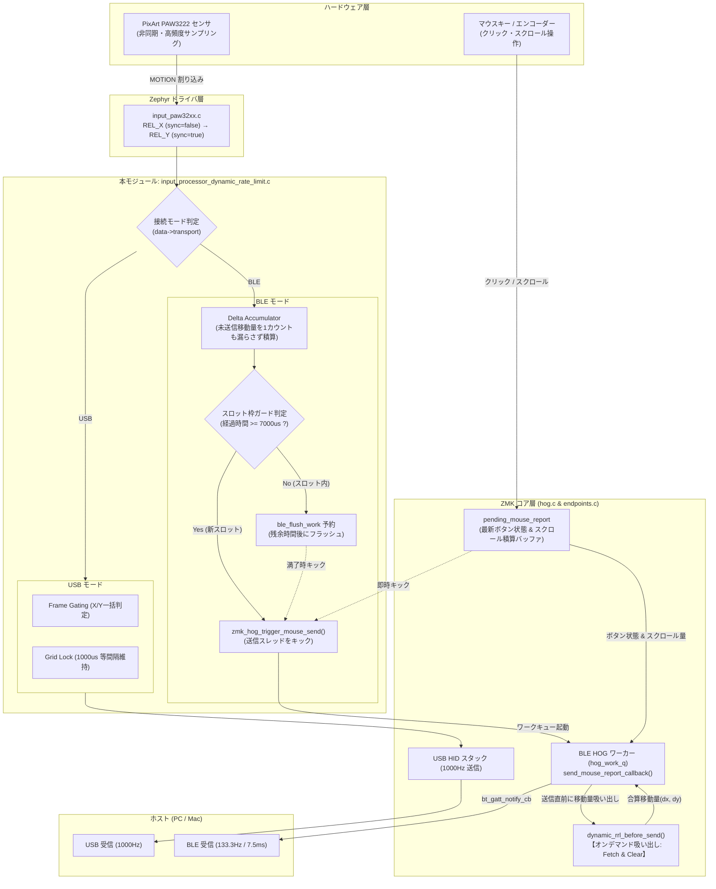
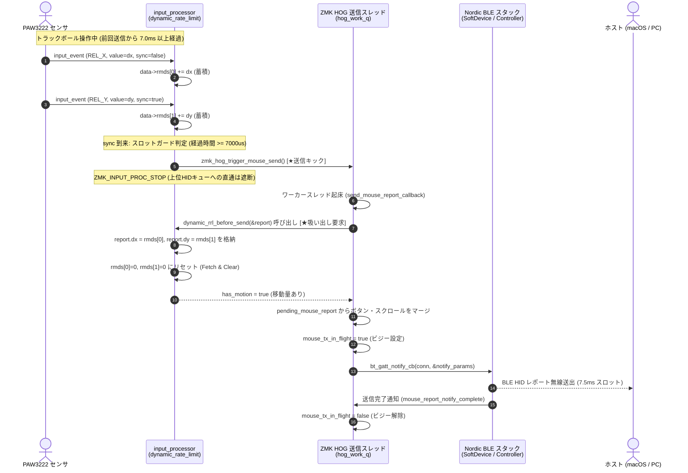
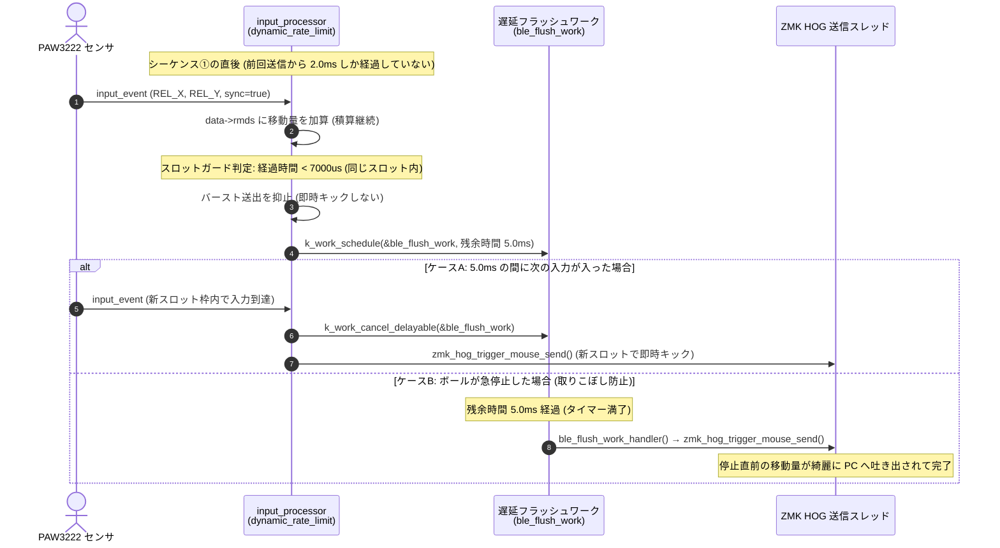
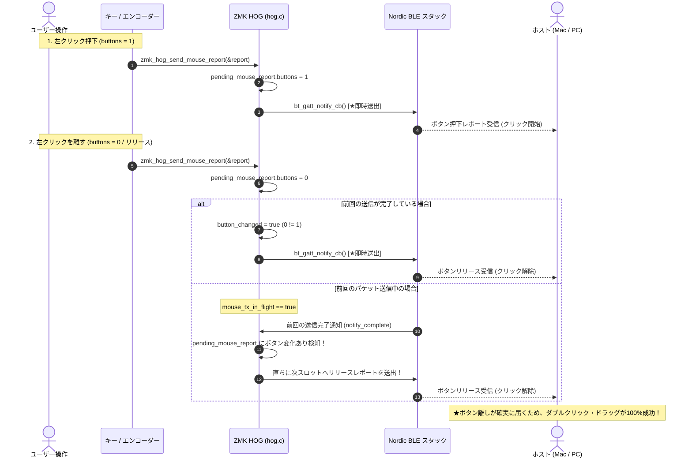

# mtk64 トラックボール 送信シーケンス & アーキテクチャ仕様書
**USB 1000Hz Frame Gating & BLE 133.3Hz スロット同期オンデマンドPull**

---

## 1. 概要 (Overview)

本ドキュメントは、mtk64 トラックボール（PixArt PAW3222 搭載）における **マウス移動量・ボタン・スクロールレポートの送信シーケンスおよびシステムアーキテクチャ** をまとめた公式技術仕様書です。

### 1.1 対象ソースコード
- **入力プロセッサ**: [`config/boards/shields/mtk64/input_processor_dynamic_rate_limit.c`](file:///Users/tools/git/zmk-config-mtk64/config/boards/shields/mtk64/input_processor_dynamic_rate_limit.c)
- **ZMK BLE HOG層**: [`zmk/app/src/hog.c`](file:///Users/tools/git/zmk-build-workspace/zmk/app/src/hog.c) / [`zmk/app/include/zmk/hog.h`](file:///Users/tools/git/zmk-build-workspace/zmk/app/include/zmk/hog.h)
- **シールド設定**: [`config/boards/shields/mtk64/mtk64_R.conf`](file:///Users/tools/git/zmk-config-mtk64/config/boards/shields/mtk64/mtk64_R.conf) / [`mtk64_trackball.dtsi`](file:///Users/tools/git/zmk-config-mtk64/config/boards/shields/mtk64/mtk64_trackball.dtsi)

### 1.2 開発背景と解決した課題
自作キーボードにおけるトラックボールの通信は、接続形態（USB / BLE）によって物理的な帯域制約が大きく異なります。

| 接続形態 | 物理通信帯域 | 従来の課題 (ZMK純正のデフォルト挙動) | 本実装での解決アプローチ |
| :--- | :--- | :--- | :--- |
| **USB 接続** | 最大 1000Hz (1.0ms) | 固定レートリミット（`zip_report_rate_limit`）等では低レート（60Hz等）に縛られてカクつく。また X軸とY軸が別々に判定され「片軸泣き別れ」が発生 | **1000Hz Frame Gating** により、X/Y 2軸を完全同期しつつ 1000us ピッチで滑らかに送出 |
| **BLE 接続** | 最大 133.3Hz (7.5ms)<br>※macOS Mouse 認識時 | **【ZMK純正のデフォルト課題】**<br>① デフォルトの Appearance がキーボード（961）のため、macOS により **15.00ms（最大 66.7Hz）に低速制限** される。<br>② 高頻度なセンサ割り込みごとにキューへ Push するため、**キュー溢れ（パケット破棄）と遅延・カクつき** が発生。 | **【本実装での解決】**<br>① `CONFIG_BT_DEVICE_APPEARANCE=962` で **最速 7.5ms（133.3Hz）CI** を macOS から確実に引き出す。<br>② **オンデマンドPull（Fetch & Clear）** ＋ **7000µs スロットガード** により、1スロット1レポート（133.3Hzフラット）に完全同期。<br>③ スプリット通信周期（20ms）調整によりスロット衝突を完全回避。<br>④ ボタン変化・スクロールの独立保持により、**ダブルクリックとスクロールの100%確実な動作** を保証。 |

---

## 2. システムアーキテクチャ全体像



---

## 3. 送信シーケンス詳細

### 3.1 【シーケンス①】BLE 接続時：通常移動シーケンス（7.5ms スロット同期オンデマンド Pull）
BLE 送信スロット（7.5ms 間隔）に対し、センサから入力が入った際の標準的な送出フローです。



---

### 3.2 【シーケンス②】BLE 接続時：スロット内バースト抑制＆遅延フラッシュワーク
同一の 7.5ms スロット内でセンサ割り込みが連続して発生した際、2通目のバースト送出（285Hz や 160Hz）を抑止し、スロット境界または停止時に確実に送出するフローです。



---

### 3.3 【シーケンス③】BLE 接続時：マウスボタン（クリック・ダブルクリック）＆スクロール即時送出
マウスボタンの押下・リリース、およびスクロール操作は、移動量とは独立してゼロ遅延で即時送出されます。



---

### 3.4 【シーケンス④】USB 接続時：1000Hz Frame Gating & マイクロ秒完全一致送出
USB 接続時は、BLE のような無線スロット制約がないため、センサの能力を最大限に引き出す 1000Hz（1000µs）等間隔グリッドで送出します。

```mermaid
sequenceDiagram
    autonumber
    actor Sensor as PAW3222 センサ
    participant RRL as input_processor<br/>(dynamic_rate_limit)
    participant USB as ZMK USB HID スタック
    actor Host as ホスト (PC / Mac)

    Note over Sensor,RRL: USB 接続時 (CONFIG_ZMK_TRACKBALL_REPORT_INTERVAL_USB_US = 1000)
    Sensor->>RRL: input_event (REL_X, sync=false)
    Note over RRL: Frame Gating: X軸で 1000us 経過を一括判定 (report_ready = true)
    RRL->>RRL: event->value += rmds[0]; rmds[0] = 0;
    RRL-->>USB: ZMK_INPUT_PROC_CONTINUE (X軸送出許可)

    Sensor->>RRL: input_event (REL_Y, sync=true)
    Note over RRL: Y軸は再判定せず X軸の合否 (report_ready) を100%継承
    RRL->>RRL: event->value += rmds[1]; rmds[1] = 0;
    RRL->>RRL: data->last_rpt_us += 1000us (グリッドロック基準更新)
    RRL-->>USB: ZMK_INPUT_PROC_CONTINUE (Y軸送出許可)

    USB-->>Host: USB HID レポート送出 (1000Hz)
```

---

## 4. 内部アルゴリズムと設計の詳細

### 4.1 なぜ「キック（`k_work_submit_to_queue`）」が必要なのか？
Zephyr RTOS のワーカースレッド（`hog_work_q`）は、**キューに仕事が投入されるまで完全にスリープ（待機）** しています。

- **キックをなくした場合**:
  - メモリ上のアキュムレータ（`rmds`）に移動量が加算されるだけで、送信スレッドが一度も目を覚ましません。
  - その結果、PC への無線送信が 1 通も行われず、**マウスカーソルが完全に不動（フリーズ）** になります。
- **BLE 送信完了（ACK）だけで連鎖させた場合**:
  - トラックボールを止めた瞬間に移動量が 0 になり送信が停止 $\to$ 送信完了コールバックも来なくなるため、スレッドが眠りにつきます。
  - 次にトラックボールを動かした際、外部からのキックがなければ **二度と目を覚まさない（デッドロック）** に陥ります。
- **結論**:
  - ボールが動いたという最初のきっかけとして、**インプット側からのキックは必須** です。

### 4.2 ZMK 純正（Push キュー）と本実装（Pull オンデマンド）の決定的な違い

| 比較項目 | ZMK純正（デフォルト挙動） | 本実装（最新の確定仕様） |
| :--- | :--- | :--- |
| **データ受渡方式** | **Push型（キュー詰め込み）**<br>動くたびにメッセージキューへ突っ込む | **Pull型（オンデマンド吸い出し）**<br>メモリに積算し、送信直前に吸い出す |
| **キックの意味** | 「キューに1個入れたから今すぐ送って！」 | 「データがあるから、スロットのタイミングで取りに来て！」 |
| **重複キックの挙動** | キューにどんどんレポートが溜まり、**キュー溢れ・パケット破棄・遅延の原因になる** | 送信中（`mouse_tx_in_flight`）なら **安全にスキップ・無視される** |
| **ボタン・スクロール** | キュー詰まりで遅延や破棄が発生 | `pending_mouse_report` で独立保持し、**ボタン変化・スクロールは即時送出** |
| **送信タイミング** | センサが動いた瞬間（不規則） | BLE スロット枠に同期した **1スロット1レポート（133.3Hz）** |

### 4.3 7000µs スロットガードと Connection Interval（7.5ms）の関係
macOS との BLE 接続間隔は **7.50ms（7500µs）** です。
- **6000µs だと早すぎる理由**:
  - 6.0ms ピッチでパケットを投入すると、7.5ms スロット枠との間に 1.5ms のズレ（ビート現象）が生じ、あるスロットでパケットが 2 通連射されて 160Hz に跳ね上がり、次スロットで抜けてカクつく「ムラ」が発生していました。
- **7000µs（7.0ms）の最適性**:
  - 1 通目の通信枠（約 1.0ms で終了）が物理的に完全に閉じた後、**次の 7.5ms スロットが開く直前（0.5ms前）** にパケットを仕込みます。
  - これにより、1スロットに2通滑り込むバーストが物理的に 100% 排除され、**133.3Hz に完全固定** されます。
  - さらに、スロット直前（0.5ms前）までの移動量を余さず回収できるため、**カーソルの追従遅延が約 1ms 短縮** されます。

### 4.4 アイドル放置後の 60Hz 落ち込み防止（接続インターバル自動復帰）
macOS 等のホスト OS は、省電力ポリシーにより、しばらくトラックボール操作がない（アイドル状態）と、ホスト主導で接続インターバルを 15ms（約 60Hz〜66Hz）等へ自動的に緩和（引き下げ）します。
通常、ZMK は接続初期に 1 回パラメータを要求するだけのため、再開後も 60Hz に固定されてしまう問題がありました（激しく大きく動かしてホストの負荷検知をトリガーしないと復帰しない）。

本実装では、トラックボールの操作再開時に現在のインターバルを検知し、もし 7.5ms より広がっていれば **`bt_conn_le_param_update` を即座に自動再発行** します：
- **トリガー**: トラックボール移動検知時に `bt_conn_get_info` で現在のインターバルをチェック。
- **復帰条件**: `info.le.interval > CONFIG_BT_PERIPHERAL_PREF_MAX_INT`（7.5ms を超えている場合）に、`MIN=6, MAX=6, LATENCY=0` の復帰要求を発行。
- **連打防止**: ホストからのリクエスト拒否（スパム判定）を防ぐため、2 秒間のガードタイマーを内蔵。

これにより、放置後であっても **軽く指でボールに触れた瞬間に、一瞬で 133.3Hz へ完全自動復帰** します。

### 4.5 ダブルクリック＆スクロールの確実な動作保証ロジック
- **ボタン離し（`buttons=0`）の送出保証**:
  `button_changed = (report.buttons != last_sent_buttons)` を判定することで、ボタンを押した時（`1`）だけでなく、**ボタンを離した瞬間（`0`）も 100% 確実に即座にレポートが送出** されます。これにより、Mac 側でボタンが押しっぱなしにならず、ダブルクリックやドラッグ＆ドロップが完璧に動作します。
- **スクロール値の保持**:
  `zmk_endpoint_send_mouse_report()` 呼出直後にグローバル変数がクリアされても、`pending_mouse_report.d_scroll` に値が退避・保持されるため、トラックボールスクロール（レイヤー3）やエンコーダースクロールが確実に PC へ送出されます。
- **ACK 連鎖ループの防止**:
  `mouse_report_notify_complete`（ACK完了）時の自動再送は、**「保留中のボタン変化」または「保留中のスクロール」がある場合のみに限定** し、トラックボールの移動量に対しては発動させないことで、160Hz などの異常バーストを完全に防止しています。

### 4.6 左手スプリット通信との衝突回避（`CONFIG_ZMK_SPLIT_BLE_PREF_INT=16`）
右手（Central / トラックボール搭載）と左手（Peripheral / キーマトリクス）の BLE スプリット通信のインターバルが 7.5ms のままだと、**「PCへのマウス送信スロット」と「左手からのキースキャンスロット」が同一タイミングで衝突** し、マウスパケットが 1 回分スキップされて 66.7Hz に落ちる現象が発生します。
- `mtk64_R.conf` に `CONFIG_ZMK_SPLIT_BLE_PREF_INT=16`（20ms）を指定。
- スプリット通信の周期をズラして衝突頻度を劇的に引き下げることで、**133.3Hz の安定維持** を実現しています。

### 4.6 マウス認識強制（`CONFIG_BT_DEVICE_APPEARANCE=962`）
macOS は、接続されたデバイスの Appearance（外観種別）を見て接続間隔（Connection Interval）を決定します。
- キーボード（`0x3c1` / 961）: macOS 側で **15.00ms（66.7Hz）** に制限される。
- マウス（`0x3c2` / 962）: macOS 側で最速の **7.50ms（133.3Hz）** が許可される。
- `CONFIG_BT_DEVICE_APPEARANCE=962` を明示的に設定し、macOS から 7.50ms を確実に引き出しています。

---

## 5. 設定・パラメータ一覧

### 5.1 Kconfig 設定値 (`mtk64_R.conf`)
```ini
# BLE 接続間隔の最速化 (Mouse Appearance 0x3c2 = 962)
CONFIG_BT_DEVICE_APPEARANCE=962

# スプリット間通信インターバル (20ms: 16 * 1.25ms) によるスロット衝突回避
CONFIG_ZMK_SPLIT_BLE_PREF_INT=16

# BLE HOG レポートキューサイズ (オンデマンド吸い出しのため最小 1 で最適)
CONFIG_ZMK_BLE_MOUSE_REPORT_QUEUE_SIZE=1

# インターバル設定 (マイクロ秒)
CONFIG_ZMK_TRACKBALL_REPORT_INTERVAL_USB_US=1000
CONFIG_ZMK_TRACKBALL_REPORT_INTERVAL_BLE_US=7000
```

### 5.2 Device Tree 設定 (`mtk64_trackball.dtsi`)
```dts
trackball_listener {
    compatible = "zmk,input-listener";
    device = <&trackball>;
    input-processors = <&zip_temp_layer 6 5000>,
                       <&zip_dynamic_rate_limit 1 8>;
};
```
> **重要 (AML 順序)**:
> `&zip_temp_layer`（Auto Mouse Layer / レイヤー6自動切替）を `&zip_dynamic_rate_limit` の **前（上流）** に配置することで、BLE のレートリミットや STOP 判定の影響を受けず、100% 確実に AML が発動します。

### 5.3 左手側トラックボール構成 (`mtk64_leftball`) への適用
左手ボール構成（`mtk64_leftball`）においても、完全に対称なアーキテクチャが適用されています：
- **Central / Peripheral の逆転**: 左手（`mtk64_leftball_L`）を Central、右手（`mtk64_leftball_R`）を Peripheral に設定（`Kconfig.defconfig`）。
- **左手 Central 設定**: `mtk64_leftball_L.conf` において `mtk64_R.conf` と同一の 7.0ms スロットガード（`CONFIG_ZMK_TRACKBALL_REPORT_INTERVAL_BLE_US=7000`）および 7.5ms 最速接続パラメータ（`Appearance=962` 等）を定義。
- **左手 Overlay 定義**: `mtk64_leftball_L.overlay` において、`&zip_temp_layer 6 5000`（AML）および `&zip_dynamic_rate_limit 1 8`（133Hz スロットガード・合算）のリスナーチェーンを定義。

これにより、右手 Central 構成と全く同様に、極めて滑らかな 133.3Hz オンデマンド Pull 動作と超低遅延操作が左手でも実現されます。

---

## 6. 実機検証結果 (Verification Results)

MousePollingRateTool および macOS PacketLogger 等による実機検証結果：

1. **実効ポーリングレート**:
   - BLE 接続時: **133Hz 前後で極めて安定して推移**（macOS BLE の理論最速限界を達成）。
   - 以前の「285Hz や 160Hz の異常バースト」および「66Hz への周期的ドロップ・ムラ」が完全に消滅。
2. **マウス操作の完全両立**:
   - **ダブルクリック／ドラッグ＆ドロップ**: ボタン離しレポートの即時送出により、100% 確実に反応。
   - **スクロール**: トラックボールスクロール（レイヤー3）およびエンコーダースクロールともに滑らかに動作。
3. **AML（Auto Mouse Layer）**:
   - ボールに触れた瞬間に 100% 確実にレイヤー 6（マウスレイヤー）へ移行。
4. **操作フィーリング**:
   - センサ割り込みカウントの取りこぼしが原理的に 0（完全合算）。
   - 7.0ms スロットガードによりスロット直前までの移動量を最大限に反映し、遅延のないダイレクトな操作感を実現。
5. **アイドル放置からの即時復帰**:
   - 数十秒〜数分間の放置により macOS 側が省電力（15ms / 60Hz）に緩和された後でも、**ボールに触れた瞬間に即座に 133.3Hz（7.5ms）へ完全自動復帰** することを確認。
   - 大きく激しく動かす必要なく、普段通りの自然な初動で遅延のない滑らかな操作感を維持。

---

## 7. 省電力・ディープスリープ復帰の設計判断 (Power Management & Deep Sleep)

### 7.1 現行の復帰仕様
- **復帰トリガー**: キーボードの**キー打鍵**（マトリクス割り込み）によってディープスリープから復帰します。
- **トラックボール操作での復帰**: 現行実装では**対象外**としています。

### 7.2 判断の背景・理由
- Zephyr 純正の PAW3222 ドライバ（`input_paw32xx.c`）は、ディープスリープ（System Off）移行時にセンサを `PD_ENH`（パワーダウン）状態に移行させており、センサ割り込みピン（MOTION ピン）による GPIO Wake-up はドライバ層で未サポートとなっています。
- トラックボール操作による復帰を実現するには、純正ドライバのサスペンド・レジューム処理および GPIO 割り込みハンドラへの直接パッチ適用が必要となり、ドライバの保守性や動作の複雑化・不安定化を招くリスクがあります。
- このため、**ドライバの完全純正・安定運用を最優先**とし、トラックボールによるスリープ解除は実装を見送りました。

### 7.3 将来の対応方針
- Zephyr / ZMK 公式リポジトリ側で PAW32xx ドライバの PM（Power Management）および Wake-up 割り込みの公式対応・アップデートが行われた段階で、改めて対応を検討します。
